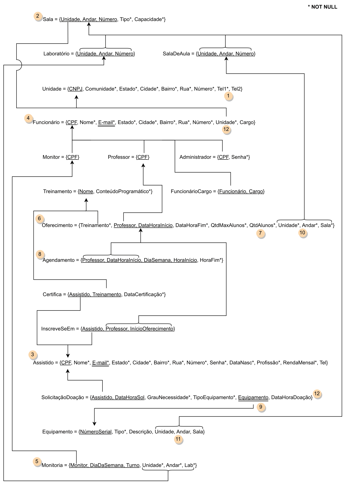

# Bridge - A System for Access and Technological Training for local communities.
Tecnologies Used
Python3 - Used for making the prototype that acess the API for the DBMS
PostegreeSQL - Data base management system, used for making the tables and queries

# RUNNING the prototype
### Libreries needed:
psycopg2<br>python-dotenv<br><br>For installing these libraries using python install package in Linux Ubuntu you can run this:
<br>
```
pip install psycopg2-binary
pip install python-dotenv
```
### Make sure you have your dotenv file in the src folder (Don't forget to change DB_USER and DB_PASSWORD) 
```
DB_HOST=localhost
DB_PORT=5432
DB_NAME=bridge
DB_USER=<your_user>
DB_PASSWORD=<your_password>
```
<br>

# Entity–relationship model


# Relational model


### Authors

|        Nome                         |    NUSP   |           E-mail            |
|:-----------------------------------:|:---------:|:---------------------------:|
|     Danielle Modesti                |  12543544 |    dani.modesti@usp.br      |
|   Eduardo Figueiredo Freire Andrade |  11232820 |    duzinho039@usp.br        |
|   Hélio Nogueira Cardoso            |  10310227 |    helionc1999@usp.br       |
|   Jhonathan Oliveira Alves          |  11838116 |    jhonathanoliveira@usp.br |
|   Pedro Dias Batista                |  10769809 |    pedrodb@usp.br           |
